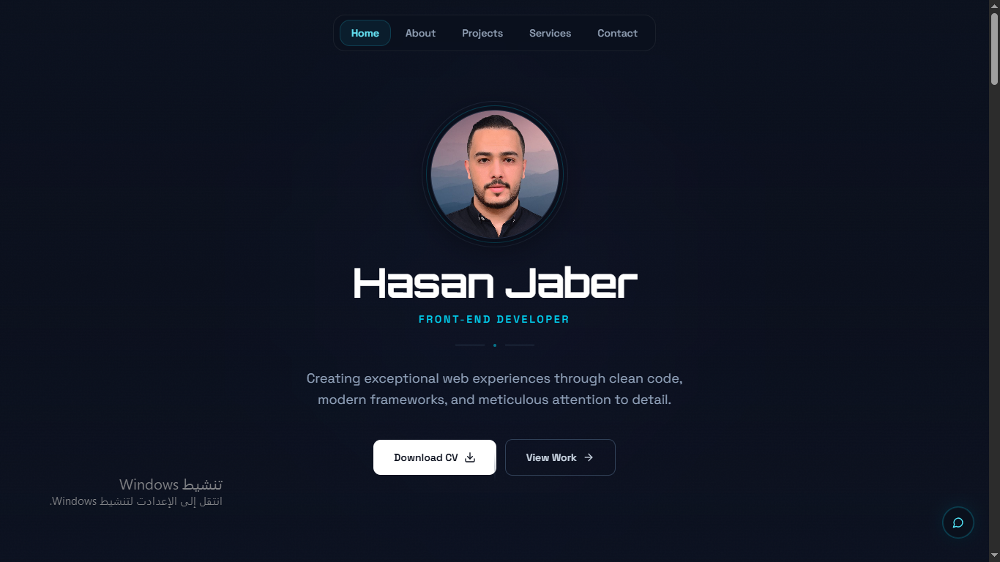

# 🚀 Hasan Jaber Portfolio

A modern, high-performance portfolio website showcasing my work as a Front-End Developer.
Built with a focus on clean UI, smooth animations, and real-world usability.

🔗 **Live Demo:**
https://hassanjaberdev.github.io/portfolio/

---

## 📸 Preview



---

## ✨ Features

* 🎯 Clean and modern UI design
* 📊 Freelance performance dashboard integration
* 💼 Projects showcase section
* 📄 Downloadable CV
* 🌙 Dark mode support
* ⚡ Smooth animations with Framer Motion
* 📱 Fully responsive across all devices

---

## 🛠️ Tech Stack

* **React**
* **TypeScript**
* **Vite**
* **Tailwind CSS**
* **Framer Motion**

---

## 📁 Project Structure

```
src/
 ├── components/
 ├── pages/
 ├── assets/

public/
 ├── images/
 └── cv/
```

---

## ⚙️ Getting Started

### 1. Clone the repository

```
git clone https://github.com/hassanjaberdev/portfolio.git
cd portfolio
```

### 2. Install dependencies

```
npm install
```

### 3. Run the development server

```
npm run dev
```

---

## 🏗️ Build for production

```
npm run build
```

---

## 🌍 Deployment

This project is deployed using **GitHub Pages** via **GitHub Actions**.

---

## 📄 Resume

👉 [Download CV](https://hassanjaberdev.github.io/portfolio/cv/hasan-cv.pdf)

---

## 🎯 Highlights

* Built with scalable front-end architecture
* Focus on performance and clean code
* Designed for real client use cases

---

## 👨‍💻 Author

Hasan Jaber
Front-End Developer

* GitHub: https://github.com/hassanjaberdev
* LinkedIn: (add your link here)

---

## ⭐ Support

If you like this project, consider giving it a ⭐ on GitHub!
